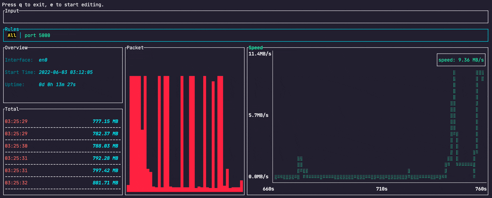

Language : 🇺🇸 English | [🇨🇳 简体中文](./README.zh-CN.md)

<h1 align="center">netop</h1>
<div align="center">

[](https://hub.docker.com/r/zingerbee/netop)
[](https://hub.docker.com/r/zingerbee/netop/tags)
[](https://hub.docker.com/r/zingerbee/netop/tags)

</div>

<div align="center">

[](https://github.com/ZingerLittleBee/netop/actions)
[](https://github.com/ZingerLittleBee/netop/commits/main)
[](./LICENSE)

</div>

<div align="center">

</div>

## Overview
`netop` is a terminal command line interface that can customize the filter **network traffic** rule 🎯

### Features
- Use the `bpf` rule filter
- Multi-rule switching
- Real-time rate
- Total traffic
- Response UI
- Resource occupation is small, `rust` Written
- Support `docker` deployment

## Installation

### Docker
```bash
docker run -it --rm --net=host zingerbee/netop
```


### Cargo
need `rust` and `pcap`, detail look at [How to build](#How-to-build-from-source)
```bash
# install
sudo cargo install netop
# and then run
netop
# or designated network interface card running
netop -n eth0
```

### NetBSD
On NetBSD there's an official package available.
To install a pre-compiled binary, simply run
```bash
pkgin install netop
```

Or, if you prefer to build it from source,
```bash
cd /usr/pkgsrc/net/netop
make install
```

### Arch Linux
[AUR](https://aur.archlinux.org/packages/netop)
> Thanks to @kemelzaidan for the contribution!

## How to use

- Press `e` to **enter edit mode** input [bpf rule](https://biot.com/capstats/bpf.html), and then press `enter`
- Press `Esc` to **exit edit mode**
- Use the `<-` or `->` to switch between different rules
- Not in edit mode, press `dd` to delete current rule
- Not in edit mode, press `q` to quit

### View help
```bash
netop -h
# docker
docker run -it --rm --net=host zingerbee/netop -h
```
Output as follows
```bash
netop 0.1.4

USAGE:
    netop [OPTIONS]

OPTIONS:
    -h, --help           Print help information
    -n, --name <NAME>    Name of Network Interface Card
    -V, --version        Print version information
```

### Designated network interface card running
> The parameter is **name of network interface card**
>
> *unix: Use `ifconfig` to view network interface cards information
>
> windows: Use `ipconfig` to view network interface cards information
```bash
netop -n eth0
# docker
docker run -it --rm --net=host zingerbee/netop -n eth0
```

## How to build from source
Development environment
- It is best to be `root` user, `pcap` requires permissions
- `rust` >= 1.40.0
- `pcap`
    - Ubuntu、Debian: `apt install libpcap-dev`
    - MacOS: installed by default
    - Windows: Download the [WinPcap](https://www.winpcap.org/install/default.htm) Developer's Pack. Add the /Lib or /Lib/x64 folder to your LIB environment variable.

```bash
sudo cargo install --path .
# or
sudo cargo run
```

## Found an issue or have a proposal
[Create an issue](https://github.com/ZingerLittleBee/netop/issues)

## Release Notes
SEE [CHANGELOG](./CHANGELOG.md)
