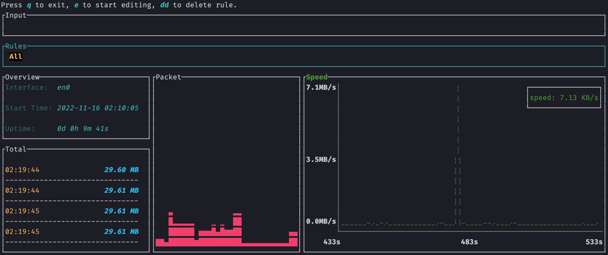

<h1 align="center">netop</h1>

## Overview
netop is a command line interface for observing network traffic

## How to use
- Press `e` to input [bpf rule](https://biot.com/capstats/bpf.html), and then press `enter`
- Use the `<-` or `->` to switch between different rules